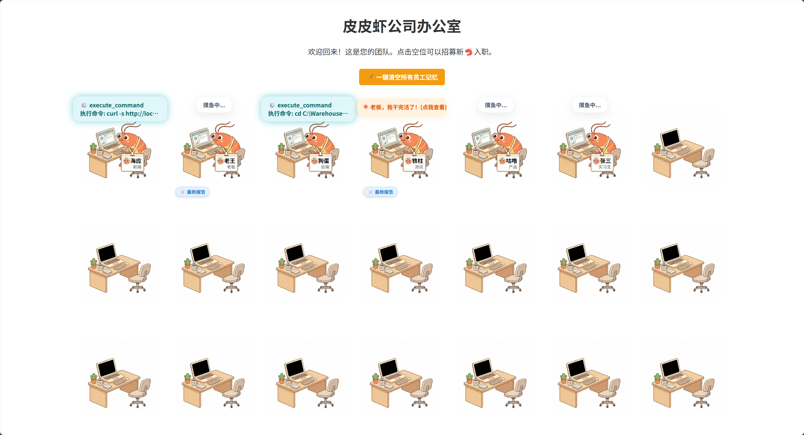

# 🦐 PiPiClaw.Team - PiPiShrimp Team Collaboration Control System

<div align="center">


**A visual multi-AI Agent collaborative work management platform**


</div>

---

## 📖 Project Introduction

**PiPiClaw.Team** is a lightweight AI team collaboration control system developed with .NET 10.0. It provides a lively and fun "office" visual interface, allowing you to manage multiple AI Agent nodes just like managing real employees.

### ✨ Core Features

| Feature | Description |
|------|------|
| 🏢 **Visual Office** | Displays each AI employee's work status in a cartoon cubicle format |
| 📋 **Task Assignment** | Click a cubicle to assign tasks to a specific AI employee |
| 💬 **Streaming Conversation** | Supports real-time streaming output, displaying thoughts as they happen |
| 📊 **Status Monitoring** | 2-second polling refresh, showing employee work status in real-time |
| 📝 **Work Reports** | View complete work reports after task completion |
| 🧹 **Memory Management** | Supports clearing context memory for individual or all employees |
| 👥 **Employee Management** | Recruit new employees, modify info, or dismiss employees |
| 🔌 **Node Proxy** | Automatically forwards requests to the corresponding AI node backend |

---

## 🖼️ Interface Preview
<div align="center" style="width:100%">
  
  
</div>
  
---

## 🚀 Quick Start

### Environment Requirements

- .NET 10.0 SDK or higher
- Windows 10/11 Operating System
- One or more AI Agent nodes (PiPiShrimp nodes)

### Build & Run

```powershell
# 1. Clone the project
git clone https://github.com/anan1213095357/PiPiClaw.Team.git
cd PiPiClaw.Team

# 2. Publish AOT compiled version (optional, for smaller size and faster startup)
dotnet publish -c Release -r win-x64

# 3. Run directly
dotnet run

# Or run as administrator (if binding to a specific port is required)
Start-Process powershell -Verb RunAs -ArgumentList "dotnet run"
```

### Access the Interface

After starting, open in your browser:
```
http://localhost:4050/
```

---

## 📁 Project Structure

```
PiPiClaw.Team/
├── Program.cs              # Main program entry, includes HTTP server and frontend HTML
├── PiPiClaw.Team.csproj    # Project configuration file
├── team_config.json        # Employee contact list configuration file (generated at runtime)
├── img_shrimp_working.png  # PiPiShrimp working image (embedded resource)
├── img_empty_desk.png      # Empty desk image (embedded resource)
├── README.md               # Project documentation
├── Properties/
│   └── launchSettings.json # Launch configuration
├── bin/                    # Compilation output directory
└── obj/                    # Temporary object files
```

---

## 🔧 Configuration Guide

### Employee Contact List (team_config.json)

The system automatically generates and maintains the `team_config.json` configuration file, formatted as follows:

```json
{
  "PeerNodes": {
    "海应": {
      "url": "http://localhost:5050",
      "role": "Frontend Engineer"
    },
    "狗蛋": {
      "url": "http://localhost:5051",
      "role": "Backend Engineer"
    },
    "铁柱": {
      "url": "http://192.168.1.100:5050",
      "role": "QA Engineer"
    }
  }
}
```

| Field | Type | Description |
|------|------|------|
| `PeerNodes` | Object | Employee dictionary, Key is the employee's name |
| `url` | String | The AI node service address corresponding to this employee |
| `role` | String | The employee's position/role description |

---

## 🎯 Usage Guide

### 1. Recruit a New Employee

1. Click any **empty cubicle** or **offline cubicle**
2. Fill in the pop-up window:
   - **Employee Name**: e.g., "Haiying"
   - **Job Title**: e.g., "Frontend Engineer"
   - **Node URL**: e.g., "http://localhost:5050"
3. Click "Onboard Employee"

### 2. Assign Tasks

1. Click the cubicle of an **active employee**
2. Enter specific requirements in the task input box
3. Click "Start Working"
4. Observe the status bubble changes:
   - 🔵 **Thinking**: Employee is processing the task
   - 🟠 **Completed**: Task finished, click to view report

### 3. View Work Reports

- Click the **orange bubble** or the **📄 Latest Report** button
- View the work summary in Markdown format

### 4. Employee Management

| Action | Description |
|------|------|
| 📝 Edit Info | Change employee name, role, or node address |
| 🧹 Clear Memory | Clear the context conversation history for this employee |
| 🔥 Dismiss Employee | Remove from contact list and free up the cubicle |

### 5. Global Actions

- **🧹 Clear All Memories at Once**: Batch clear the context for all active employees

---

## 🌐 API Endpoints

The control system provides the following HTTP APIs:

| Endpoint | Method | Description |
|------|------|------|
| `/` | GET | Returns the frontend HTML page |
| `/api/config` | GET | Gets employee contact list configuration |
| `/api/config` | POST | Updates employee contact list configuration |
| `/api/chat` | POST | Assigns task (streaming response) |
| `/api/status` | GET | Queries employee work status |
| `/api/history` | GET | Gets employee conversation history/reports |
| `/api/clear` | POST | Clears individual employee memory |
| `/api/clearall` | POST | Clears all employees' memory |

---

## 🏗️ Technical Architecture

```
┌─────────────────────────────────────────────────────────────┐
│                      Browser (User Interface)                 │
│                   http://localhost:4050                     │
└─────────────────────────┬───────────────────────────────────┘
                          │ HTTP Request
                          ▼
┌─────────────────────────────────────────────────────────────┐
│              PiPiClaw.Team Control Server                    │
│  ┌─────────────┐  ┌─────────────┐  ┌─────────────────────┐ │
│  │ Static File  │  │  Configuration │  │  Request Proxy Forward │ │
│  │   Service    │  │   Management   │  │       (HTTP Client)   │ │
│  │ (HTML/CSS)   │  │  (team_config) │  │                      │ │
│  └─────────────┘  └─────────────┘  └─────────────────────┘ │
└─────────────────────────┬───────────────────────────────────┘
                          │ Forward Request
                          ▼
┌─────────────────────────────────────────────────────────────┐
│                    AI Agent Node Cluster                     │
│  ┌───────────┐  ┌───────────┐  ┌───────────┐  ┌──────────┐ │
│  │ Haiying   │  │ Goudan    │  │ Tiezhu    │  │ ...      │ │
│  │   Node    │  │   Node    │  │   Node    │  │          │ │
│  │  :5050    │  │  :5051    │  │  :5052    │  │          │ │
│  └───────────┘  └───────────┘  └───────────┘  └──────────┘ │
└─────────────────────────────────────────────────────────────┘
```

---

## 🔒 Security Notes

- The control service listens on `localhost:4050` by default, allowing local access only.
- To access via LAN, modify the listening address in `Program.cs`.
- Ensure the firewall allows the corresponding port when accessing from other computers.
- It is recommended to add an authentication mechanism in production environments.

---

## 📄 License

This project is open-sourced under the **MIT License**.

---

## 🤝 Contribution Guide

Feel free to submit Issues and Pull Requests!

1. Fork this repository
2. Create a feature branch (`git checkout -b feature/AmazingFeature`)
3. Commit your changes (`git commit -m 'Add some AmazingFeature'`)
4. Push to the branch (`git push origin feature/AmazingFeature`)
5. Open a Pull Request

---

## 📬 Contact

- **GitHub**: [anan1213095357](https://github.com/anan1213095357)
- **Repository**: [PiPiClaw.Team](https://github.com/anan1213095357/PiPiClaw.Team)

---

<div align="center">

**🦐 PiPiShrimp Company · Making AI Collaboration More Fun!**

*Made with ❤️ using .NET 10.0*

</div>
